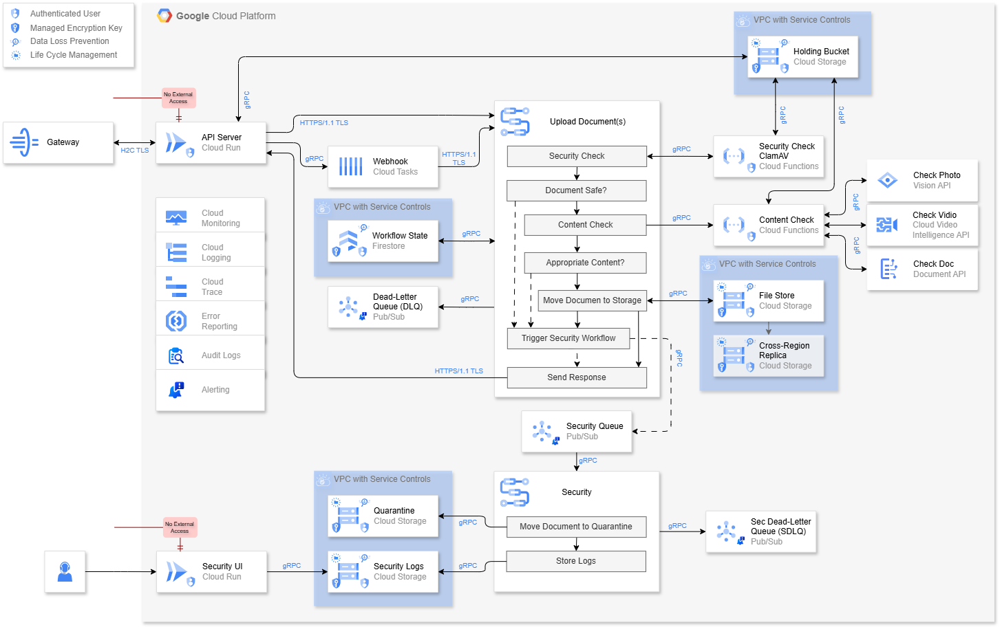

# Secure Document Ingestion and Governance Platform

A cloud-native, secure document ingestion and governance platform built on Google Cloud Platform. Designed for local government, it provides a centralised, reusable service for safely accepting, scanning, classifying, and storing documents uploaded by citizens or internal systems — with a full security response workflow for any file that fails inspection.

Built with two upload modes: **synchronous** (1–2 files, direct response) and **asynchronous** (3+ files, webhook callback), and a fully isolated **security investigation workflow** for malicious, inappropriate, or failed uploads.

---

## Architecture Overview



---

## Design Philosophy

### Secure by Default
No file touches permanent storage until it has passed both a **virus/malware scan** and a **content safety check**. Files are held in an isolated quarantine bucket during inspection and only moved to the File Store on a clean result. Every failure triggers a dedicated security workflow — nothing is silently dropped.

### Centralised and Reusable
Rather than each council system implementing its own document handling, this platform provides a single, consistent ingestion layer. Systems connect once and benefit from all scanning, storage, audit, and compliance controls automatically.

### Employee Psychological Safety
The security investigation UI is deliberately designed to protect officers who must review flagged content. Files are never downloaded or opened directly — they are rendered as reduced-resolution, greyscale thumbnails hidden behind an unsafe content warning, accessible only via a signed URL or Base64 string. This balances legal evidence preservation with duty of care to staff.

---

## Request Flow

### Synchronous (1–2 files)

```
External System / User
        │
        ▼ HTTPS 1.1 / TLS
    Gateway
        │ HTTP/2 (H2C) / TLS
        ▼
  API Server (Cloud Run)  ◄── No External Access
        │
        ▼ HTTPS 1.1 / TLS
  Upload Document(s) Workflow
        │
        ├── 1. Security Check (ClamAV) ──────────────► Holding Bucket (quarantine)
        │         │
        │    Document Safe?
        │         ├── NO  ──► Trigger Security Workflow ──► Security Queue
        │         │
        │         ▼ YES
        ├── 2. Content Check (Vision / Video Intelligence / Document AI)
        │         │
        │    Appropriate Content?
        │         ├── NO  ──► Trigger Security Workflow ──► Security Queue
        │         │
        │         ▼ YES
        ├── 3. Move Document to File Store
        ├── 4. Send Response
        └── (Holding Bucket lifecycle purges original as failsafe)
```

### Asynchronous (3+ files)

```
External System
        │
        ▼ HTTPS 1.1 / TLS
    Gateway → API Server
        │
        ▼ gRPC
  Webhook (Cloud Tasks)
        │
        ▼ HTTPS 1.1 / TLS (when less busy)
  Upload Document(s) Workflow (per file, as above)
        │
        ▼
  Callback to return_url when complete
```

### Security Workflow (triggered on any failure)

```
Security Queue (Pub/Sub)  ◄── Alert: threshold 0
        │
        ▼ gRPC
  Security Workflow
        ├── Move Document to Quarantine (Cloud Storage, VPC)
        └── Store Logs (Cloud Storage, VPC)
                │
                ▼
        Security UI (Cloud Run) ◄── Internal network only, IAM controlled
                │
        Officer reviews:
        ├── Reduced resolution, greyscale thumbnail
        ├── Hidden behind unsafe content warning
        ├── Served via Signed URL / Base64 — never downloaded
        └── Full incident logs and audit trail
                │
                ▼
        Officer takes action (report to IWF / NCA / authorities)
```

---

## Components

### Gateway
- Single entry point for all external traffic
- Converts **HTTPS 1.1 → HTTP/2 (H2C)** and vice versa
- Enforces that both the API Server and Security UI have **no direct external access**
- Security UI is additionally restricted to **internal network only**

---

### API Server — Cloud Run (GoLang)
- Written in **GoLang** — optimal for cloud-native, high-throughput services
- **No external access** — all requests must pass through the Gateway
- Determines routing: sync (1–2 files) or async via Cloud Tasks (3+ files)
- Credentials and API keys managed via **Cloud Secret Manager**
- Communicates with all internal services via **gRPC**

---

### Webhook — Cloud Tasks (Async Route)
- Activated for batch uploads of 3 or more files
- Each file is processed as an individual workflow — the callback is delivered per file or as a summary when all are complete
- Built-in retry logic handles transient failures before escalating to the DLQ
- Runs when the service is less busy, preventing ingestion spikes from affecting other platform users

---

### Upload Document(s) Workflow

The core ingestion and inspection pipeline:

#### Step 1 — Security Check (ClamAV, Cloud Functions)
- Scans every uploaded file for **viruses, malware, and malicious content** before any further processing
- Runs against the file in the **Holding Bucket** — the file never moves until it passes
- **Fail:** triggers the Security Workflow immediately; logs the incident
- **Pass:** proceeds to Content Check

#### Step 2 — Content Check (Cloud Functions)
- Routes the file to the appropriate Google AI API based on detected file type:

| File Type | Service | Checks |
|---|---|---|
| Image / Photo | Vision API | Harmful content, explicit material, safe search |
| Video | Video Intelligence API | Harmful content, explicit material, content classification |
| Document | Document AI | Content classification, sensitive data detection |

- **Fail:** triggers the Security Workflow; logs the incident
- **Pass:** proceeds to storage

#### Step 3 — Move Document to File Store
- File is moved from the **Holding Bucket** to the **File Store (Cloud Storage)** via gRPC
- Original in the Holding Bucket is removed on successful move
- File Store is within VPC with Service Controls

#### Step 4 — Send Response
- Returns the outcome and file reference to the API Server
- API Server returns the response to the origin system or user

#### Holding Bucket Lifecycle (Failsafe)
- Lifecycle policy set to **3–5 days** (accommodating weekends and bank holidays)
- In normal operation, files are moved before this triggers — the lifecycle acts purely as a failsafe cleanup for files stuck due to errors or unresolved security investigations
- Files under active security investigation must not be purged — the Security Workflow moves them to Quarantine, removing them from the Holding Bucket lifecycle scope

---

### Security Queue — Pub/Sub
- Receives security events from any failure in the workflow: ClamAV fail, Content Check fail, or DLQ escalation
- **Alert threshold: 0** — a single message triggers an immediate alert to the security team
- Kept entirely separate from the main DLQ so security events are never buried in operational noise and can be independently prioritised and actioned

---

### Security Workflow

Triggered by the Security Queue for all failure types:

| Step | Action |
|---|---|
| 1 | **Move Document to Quarantine** — file is transferred to the isolated Quarantine bucket (VPC, strict IAM) |
| 2 | **Store Logs** — all incident data is written to Security Logs: ClamAV results, Content Check results, file metadata, origin, timestamps, and full audit trail |

Everything the security team needs to investigate the incident and pass evidence to authorities is captured here.

---

### Security UI — Cloud Run
- Internal-only Cloud Run service — **no external access**, accessible only from within the network to authorised personnel
- **Minimum instances: 0** — infrequent use; cold starts are acceptable
- Allows security officers to inspect flagged files and logs **without ever downloading or directly opening the original file**
- File rendering is deliberately restricted to protect officer wellbeing:
  - **Reduced resolution** — not full quality
  - **Greyscale** — colour removed
  - **Hidden behind an unsafe content warning** — officer must actively choose to reveal
  - **Served via Signed URL or Base64 string** — file is never downloaded to the officer's device
- Full incident logs and audit trail are accessible alongside the file view
- Officers use the UI to assess the incident and initiate reporting to the appropriate authority (IWF, NCA, or other)

> **Note:** Automated reporting integration (e.g. direct IWF/NCA API submission) is a planned enhancement pending further investigation into the Online Safety (CSEA Content Reporting) Regulations 2026 reporting process.

---

### Quarantine — Cloud Storage (VPC)
- Isolated storage for all files that have failed security or content checks
- Contained within its own **VPC with Service Controls**
- Strictly IAM-controlled — accessible only to the Security UI service account and named safeguarding officers
- **Lifecycle: 1 year** — retained in line with legal evidence preservation obligations
- Google-managed encryption keys at rest; DLP applied

---

### Security Logs — Cloud Storage (VPC)
- Stores the complete incident record for every flagged file:
  - ClamAV scan results
  - Content Check classification results
  - File metadata and origin information
  - Full audit trail of all actions taken
- Same VPC and IAM controls as the Quarantine bucket
- **Lifecycle: 1 year** — aligned with evidence retention requirements
- Provides everything needed for internal investigation and authority reporting

---

### Sec Dead-Letter Queue (SDLQ) — Pub/Sub
- Dedicated DLQ for failures **within the security workflow itself** (e.g. move to quarantine fails, log write fails)
- Entirely separate from the main operational DLQ — security failures are never mixed with general processing failures
- Ensures security workflow failures are independently monitored, prioritised, and actioned
- Alert policy configured independently from the main DLQ

---

### File Store — Cloud Storage (VPC)
- Permanent storage for all documents that have passed both security and content checks
- Contained within **VPC with Service Controls**
- **Cross-region replica** for disaster recovery
- **Google-managed encryption keys** at rest
- **Data Loss Prevention (DLP)** on stored files
- **Lifecycle Management** for data retention — files transitioned or deleted in line with retention policy

---

### Workflow State — Firestore (VPC)
- Stores the state and transaction record for each upload workflow
- Tracks progress across async batch jobs
- Contained within **VPC with Service Controls**
- Google-managed encryption keys; DLP applied

---

### Dead-Letter Queue (DLQ) — Pub/Sub
- Captures operational failures from the main upload workflow that have exhausted all retries
- Feeds into the **Security Queue** — DLQ failures are treated as security events, not just operational ones, since a file may be stuck in the Holding Bucket
- Alert policy configured at threshold 0

---

## Compliance

### GDPR — General Data Protection Regulation

This platform processes personal data contained within uploaded documents on behalf of the council as a data controller.

| Requirement | Implementation |
|---|---|
| Data minimisation | Only the file and metadata necessary for processing are ingested |
| Retention & erasure | Lifecycle Management on all buckets; 1-year retention on security evidence; configurable retention on File Store |
| Data protection by design | DLP on all storage; encryption at rest and in transit; VPC isolation; no direct file access |
| Audit trail | Security Logs, Workflow State, and Cloud Audit Logs provide a complete, immutable record |
| Breach notification (Article 33) | If a malicious file contained personal data, Cloud Audit Logs and Security Logs provide the evidence needed for ICO notification within the 72-hour window |
| Data transfer | All storage is region-pinned; VPC Service Controls prevent exfiltration |

---

### Data Sovereignty

| Requirement | Implementation |
|---|---|
| Data residency | All GCP services deployed to UK regions (`europe-west2`) |
| Cross-region replica | Configured within UK-approved region pairs only |
| Boundary enforcement | VPC Service Controls on all storage and database components |
| Audit | Cloud Audit Logs record all data access with identity and origin |

---

### SOC 2 — Service Organisation Control 2

| Trust Criteria | Implementation |
|---|---|
| **Security** | IAM least-privilege; Secret Manager; VPC isolation; no external access to API Server or Security UI; ClamAV scan on every file |
| **Availability** | Cloud Run auto-scaling; Cloud Tasks for async batch resilience; cross-region replica on File Store; DLQ and SDLQ prevent silent failures |
| **Confidentiality** | Encryption at rest; TLS/gRPC in transit; DLP; Signed URL file serving; strict IAM on Quarantine and Security Logs |
| **Processing integrity** | Sequential workflow with explicit pass/fail gates; every failure captured in Security Queue; no file stored without passing all checks |
| **Change management** | Terraform IaC; Cloud Build and Cloud Deploy CI/CD pipeline; all changes version controlled and reviewed |
| **Monitoring** | Cloud Monitoring, Logging, Trace, Error Reporting, Audit Logs, and Alerting |

---

### Online Safety Act & CSEA Content Reporting

The platform is designed to align with the **Online Safety (CSEA Content Reporting) Regulations 2026**, in force from April 2026.

| Obligation | Implementation |
|---|---|
| **Detection** | Content Check (Vision API, Video Intelligence API) scans all images and video for illegal content as part of the standard ingestion workflow |
| **Do not purge** | Files flagged by the Security Workflow are moved to Quarantine — they are **never deleted** during an active investigation |
| **Evidence preservation** | Quarantine and Security Logs retain all evidence for 1 year, with strict IAM controls limiting access to authorised safeguarding officers |
| **No direct viewing** | Security UI renders files as reduced-resolution, greyscale thumbnails behind an unsafe content warning — officers are never exposed to full-quality illegal material |
| **Reporting** | Security officers use the Security UI to review the incident and submit reports to the IWF, NCA, or other appropriate authority |
| **Audit trail** | Every action taken on a flagged file is recorded in Security Logs and Cloud Audit Logs |

> **Planned enhancement:** Direct integration with IWF/NCA reporting APIs is under investigation and will be implemented as a subsequent release once the formal reporting process under the 2026 Regulations has been confirmed.

---

### GDS — Government Design System & GOV.UK Service Standards

| Standard | Implementation |
|---|---|
| **Service Standard Point 9 — Create a secure service** | Multi-layer security: ClamAV, AI content scanning, VPC isolation, IAM, DLP, no direct file access |
| **Service Standard Point 10 — Define what success looks like** | Workflow State and Datalake sync enable reporting on ingestion volumes, failure rates, and security incidents |
| **Service Standard Point 11 — Choose the right tools** | GCP-native stack, open standards (gRPC, HTTPS, YAML), managed services reduce operational burden |
| **Duty of care (staff)** | Security UI design explicitly prioritises officer psychological safety — reduced resolution, greyscale, hidden behind content warning |
| **Data retention** | Lifecycle policies aligned with Local Government Classification Scheme (LGCS) retention schedules |

---

## Security

| Layer | Control |
|---|---|
| Network perimeter | Gateway enforces all external access; API Server and Security UI have no public exposure; Security UI restricted to internal network |
| File quarantine | All files held in Holding Bucket until passing all checks — nothing reaches File Store without a clean result |
| Virus scanning | ClamAV on every file before any further processing |
| Content scanning | Vision API, Video Intelligence API, Document AI — routed by file type |
| Secrets management | Cloud Secret Manager — no hardcoded credentials |
| Identity & access | IAM least-privilege across all services; Quarantine and Security Logs restricted to safeguarding officers |
| Data encryption | Google-managed encryption keys on all storage |
| Data protection | DLP on all buckets and Firestore |
| Retention | Lifecycle Management on all buckets; 1-year retention on all security evidence |
| Network isolation | VPC with Service Controls on Holding Bucket, File Store, Quarantine, Security Logs, and Workflow State |
| Transport security | HTTPS 1.1/TLS (external), HTTP/2 H2C/TLS (Gateway → Cloud Run), gRPC (internal) |
| Evidence integrity | Signed URL / Base64 file serving — original files never downloaded to officer devices |

---

## Protocols

| Protocol | Used Between |
|---|---|
| HTTPS 1.1 / TLS | External systems ↔ Gateway; API Server ↔ Upload Workflow; Webhook callbacks ↔ return_url |
| HTTP/2 (H2C) / TLS | Gateway ↔ Cloud Run (API Server and Security UI) |
| gRPC | Cloud Run ↔ all internal services (Cloud Tasks, Firestore, Cloud Storage, Pub/Sub, Cloud Functions) |

---

## Observability

| Tool | Purpose |
|---|---|
| Cloud Monitoring | Metrics, dashboards, uptime checks |
| Cloud Logging | Centralised structured log ingestion |
| Cloud Trace | Distributed tracing — follow an upload request end-to-end |
| Error Reporting | Automatic error aggregation and alerting |
| Audit Logs | Immutable record of all admin, data access, and security actions |
| Alerting | Security Queue alert at threshold 0; SDLQ independently monitored; DLQ alert configured |

---

## Technology Choices — Rationale

| Technology | Rationale |
|---|---|
| **GoLang** | Cloud-native performance, low memory footprint, high concurrency, native gRPC support |
| **Cloud Run (API Server, min 1)** | Scales on demand; no infrastructure to manage; cost-effective for variable ingestion load |
| **Cloud Run (Security UI, min 0)** | Infrequent use; cold starts acceptable; min 0 reduces cost |
| **Cloud Tasks** | Managed async queue for batch uploads; built-in retries; rate control prevents ingestion spikes |
| **ClamAV (Cloud Functions)** | Open source, battle-tested virus scanner; runs as a lightweight function per file |
| **Vision API / Video Intelligence API / Document AI** | Managed AI services; no model training required; routed by file type for accurate classification |
| **Cloud Storage** | Durable, cost-effective blob storage; lifecycle management; VPC-compatible; cross-region replication |
| **Firestore** | Flexible document model for workflow state; low-latency; native GCP integration |
| **gRPC** | Binary protocol, strongly typed, faster than REST for internal service communication |
| **YAML (Workflows)** | Human-readable, supports conditional branching (pass/fail/security), easy to version control |

---

## CI/CD Pipeline

| Tool | Role |
|---|---|
| **Cloud Build** | Triggered on commits — runs tests, linting, and builds container images |
| **Artifact Registry** | Stores and versions built container images securely |
| **Cloud Deploy** | Progressive delivery to environments (dev → staging → production) with approval gates |

```
Git Push
   │
   ▼
Cloud Build ──► Test & Build ──► Push image to Artifact Registry
                                          │
                                          ▼
                                   Cloud Deploy
                                          │
                          ┌───────────────┼───────────────┐
                          ▼               ▼               ▼
                         Dev          Staging         Production
```

---

## Infrastructure as Code — Terraform

```
infrastructure/
├── environments/
│   ├── dev/
│   ├── staging/
│   └── production/
├── modules/
│   ├── api/              # Cloud Run (API Server + Security UI), Secret Manager
│   ├── async/            # Cloud Tasks, DLQ, Security Queue, SDLQ
│   ├── scanning/         # Cloud Functions (ClamAV, Content Check)
│   ├── storage/          # Holding Bucket, File Store, Quarantine, Security Logs
│   ├── database/         # Firestore (Workflow State)
│   ├── networking/       # VPC, Service Controls, Gateway
│   └── observability/    # Monitoring, Logging, Alerting, Trace
└── main.tf
```

---

## Repository Structure

```
/
├── api/                  # GoLang API server (Cloud Run)
├── security-ui/          # GoLang Security UI server (Cloud Run)
├── functions/
│   ├── clamav/           # ClamAV security scan (Cloud Functions)
│   ├── content-check/    # Content routing and AI check (Cloud Functions)
├── workflows/            # YAML workflow definitions
├── infrastructure/       # Terraform — all GCP resources
├── cloudbuild.yaml       # Cloud Build pipeline definition
├── docs/
│   └── architecture.png  # Architecture diagram
└── README.md
```

---

## Licence

MIT License — see [LICENSE](./LICENSE)
